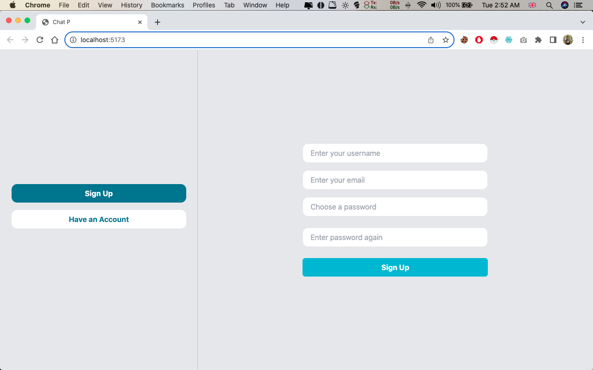
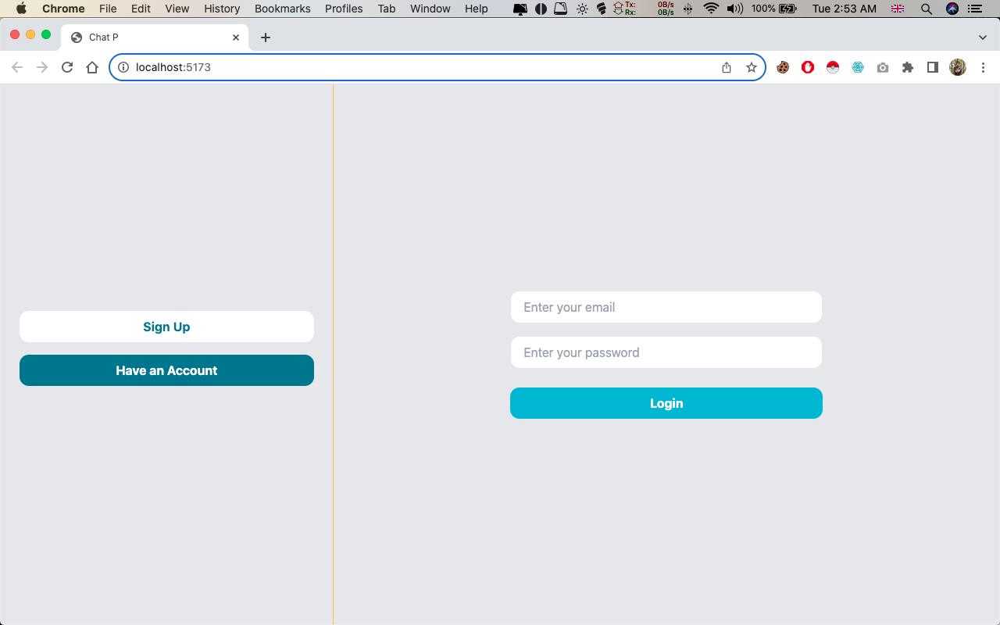
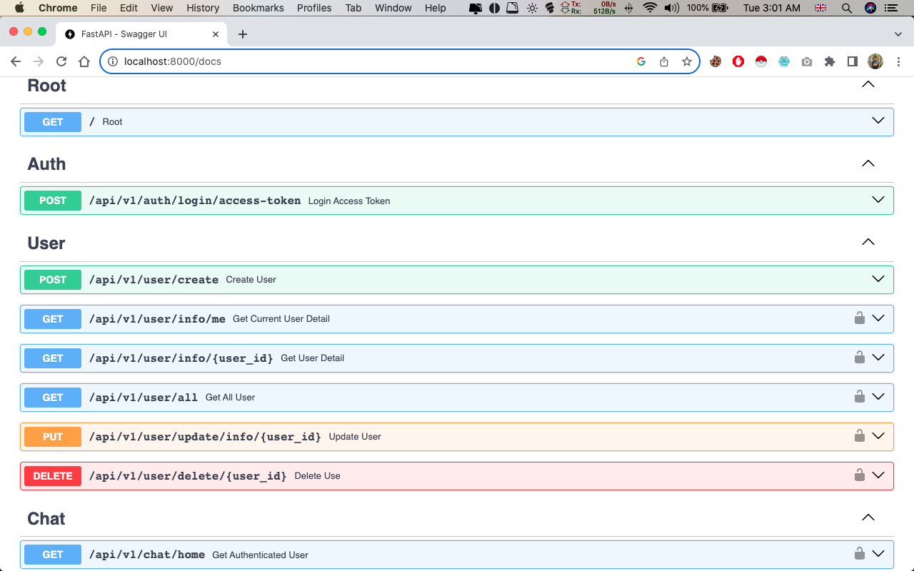
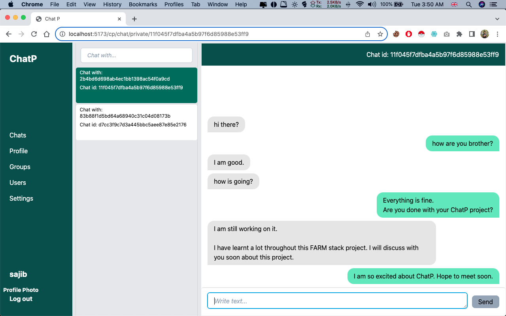

<!-- markdownlint-disable -->
<!-- This content will not be linted. -->

# Real Time Chat Application (FARM Stack Project)

This FARM (FastAPI, React, and MongoDB) project is a full-stack web application that combines the power of FastAPI for the backend, React for the frontend, and MongoDB for data storage. The project includes various features, such as JWT authentication, email verification, field validation in both client side and server side, real-time chat with WebSocket integration, separate collections for private and group chat, and Docker configurations for both backend and frontend.

## Table of Contents

- [Real Time Chat Application (FARM Stack Project)](#real-time-chat-application-farm-stack-project)
  - [Table of Contents](#table-of-contents)
  - [App Reality](#app-reality)
    - [Welcome Page](#welcome-page)
    - [Signup Page](#signup-page)
    - [Login Page](#login-page)
    - [FastAPI Docs](#fastapi-docs)
    - [Private Chat](#private-chat)
  - [Features](#features)
  - [Frontend](#frontend)
  - [Backend](#backend)
  - [Getting Started](#getting-started)
    - [Prerequisites](#prerequisites)
    - [Explore ChatP](#explore-chatp)
  - [Docker Setup](#docker-setup)
  - [Usage Instructions:](#usage-instructions)
  - [License](#license)

## App Reality

### Welcome Page


### Signup Page



### Login Page



### FastAPI Docs



### Private Chat



## Features

-   **FastAPI Backend**: Provides RESTful API endpoints.
-   **React Frontend**: User-friendly interface.
-   **MongoDB Database**: Efficient data storage.
-   **JWT Authentication**: Secure user access.
-   **Email Verification**: Required verification of email addresses for account activation.
-   **Field Validation**: Ensures data integrity.
-   **WebSocket Integration**: Real-time chat functionality.
-   **Separate Collections**: Distinct storage for private and group chat.
-   **Docker Setup**: Containerized development environment.


## Frontend

The frontend of our Real Time Chat Application is built with React and Vite for a fast development experience. It offers a responsive user interface for real-time chat and includes the following technologies:

-   **React**: A powerful JavaScript library for building user interfaces.
-   **Vite**: A modern development environment that optimizes frontend development.
-   **Dependencies**: Axios, Framer Motion, React Router, and Websocket Client for efficient communication.
-   **DevDependencies**: ESLint and Tailwind CSS for code quality and styling.

Our frontend incorporates client-side authentication, enhancing security and user access control. This ensures that only authorized users can access certain features of the application.

## Backend

Our backend, powered by FastAPI, is the backbone of the Real Time Chat Application. It utilizes various dependencies to ensure high-performance and secure functionality, including:

-   **FastAPI**: A modern Python framework for efficient API development.
-   **Pydantic**: Ensures data validation and settings management.
-   **Motor and PyMongo**: Connects to MongoDB for database support.
-   **WebSockets**: Enables real-time chat using libraries like python-socketio and starlette.
-   **Cryptography and Passlib**: Provide security for communication and user password storage.
-   **Celery**: Implements asynchronous processing for tasks like email verification, enhancing the application's responsiveness and scalability.

Our backend offers robust user authentication and authorization, both on the client and server sides. Real-time chat functionality is seamlessly integrated with the security features. The development environment is optimized for speed and efficiency, using Uvicorn to serve the FastAPI application.


## Getting Started
### Prerequisites
Before you begin, ensure you have met the following requirements:

-   Node.js and npm installed for React (+ vite) development
-   Python and pip installed for FastAPI development
-   MongoDB server up and running
-   Clone or download this repository to your local machine
  
### Explore ChatP

1. **Clone or Download Repository**

    - Use https://github.com/rhsajib/real-time-chat-app.git


2. **Backend Setup:**

    ```bash
    # Environment variable setup

    $ cd real-time-chat-app/chatp-root/backend/app

    - follow the steps written in .env.demo file
    ```

    ```bash
    $ cd real-time-chat-app/chatp-root/backend
    $ pip install -r requirements.txt
    $ uvicorn app.main:app --reload
    ```

    Your FastAPI server should be running on `http://localhost:8000`.

3. **Frontend Setup:**
   
     ```bash
    # Environment variable setup

    $ cd real-time-chat-app/chatp-root/frontend

    - follow the steps written in .env.demo file
    ```

    ```bash
    $ cd real-time-chat-app/chatp-root/frontend
    $ npm install
    $ npm run dev
    ```

    Your React development server should be running on `http://localhost:8080`.

4. **Celery Setup**
    ```bash
    $ cd real-time-chat-app/chatp-root/backend
    $ celery -A app.services.worker.celery.celery worker --loglevel=info
    ```
5. **Redis Configuration:**

    - Set up your Redis in the backend

6. **Database Configuration:**
    - Set up your MongoDB connection in the backend.


## Docker Setup

-  **Docker Compose:**

    `docker-compose.yml` for setting up the development environment with both backend and frontend containers.

    First setup environment variavles.

    - Follow Backend Setup and Frontend Setup in [Explore ChatP](#explore-chatp) section.

    
    
    Now use the following command to start the containers.

    ```bash
    $ cd real-time-chat-app/chatp-root
    $ docker-compose up --build
    ```

    The backend should be accessible at `http://localhost:8000`, and the frontend at `http://localhost:8080`.


## Usage Instructions:

- **Initialization:**
  - When you first launch the application, the database will be devoid of any user accounts.
  - To commence, you must establish multiple user accounts, each possessing a unique email address.
  - This initial setup is a one-time process.

- **Creating User Accounts:**
  - Begin by creating individual user profiles with distinct email addresses.
  - Ensure that each account is uniquely identified to avoid any validation error.

- **Engaging in Conversations:**
  - Once you have successfully created two or more user accounts, you can commence meaningful conversations with other users. 
  - You will get all user in `Users` from siderbar.
  - This is where the real-time chat functionality comes to life, allowing you to interact seamlessly with other users on the platform.

<!-- ## Project Structure

- **backend:** Contains the FastAPI backend code.
- **frontend:** Contains the React frontend code.
- **scripts:** Helpful scripts for development or deployment.
- **docs:** Documentation for your project. -->

<!-- ## API Endpoints

- List and describe the available API endpoints here. -->


<!-- ## Database

- Explain how to set up and configure your MongoDB database.
- Describe the organization of collections, including separate collections for private and group chat. -->

<!-- ## WebSocket Integration

- Explain how WebSocket integration works for real-time chat.
- Describe the structure and functionality of WebSocket endpoints. -->

<!-- ## Authentication

- Explain how JWT authentication is implemented for secure user access.
- Provide details on user registration and login processes. -->


## License

This project is licensed under the MIT License - see the [LICENSE.md](LICENSE.md) file for details.

<!-- markdownlint-restore -->
<!-- This content will be linted. -->
